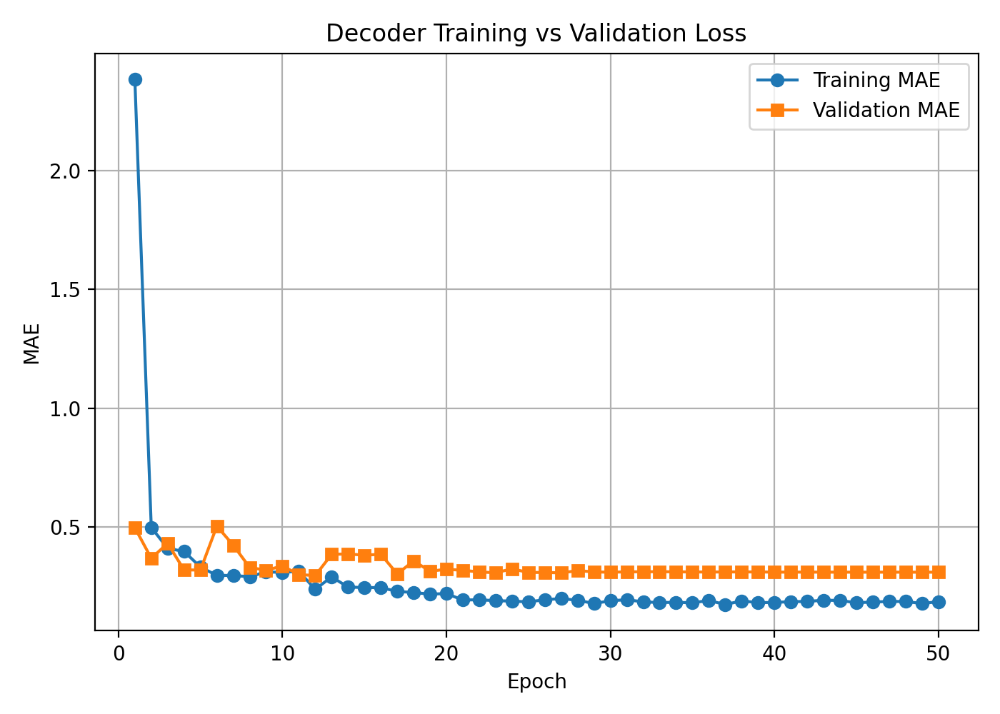

# DINOv2 Feature Inversion with Lightweight Convolutional Decoder

Author: İrem Ölçün 
GT-ARC Research Internship – 2025 

---

## Abstract

This project investigates whether high-level semantic embeddings produced by **DINOv2** can be effectively inverted into the image space using a compact convolutional decoder.

The central research question is:

> How much spatial and structural information is preserved in self-supervised feature embeddings, and can a lightweight CNN reconstruct coherent high-resolution RGB images from them?

A complete end-to-end pipeline is implemented, including:

- feature extraction 
- dataset construction 
- decoder training 
- quantitative evaluation 
- inference and visualization 

The results demonstrate stable convergence using a small architecture and a simple L1 reconstruction loss, confirming that DINOv2 embeddings retain significant global structural information.

This work contributes to understanding the information density and invertibility properties of self-supervised vision representations.

---

## Research Motivation

Self-supervised vision models such as DINOv2 encode rich semantic representations. 
However, the degree to which these representations preserve reconstructible spatial information remains an open question.

Instead of relying on large generative models, this work deliberately constrains model capacity to:

- analyze embedding information density 
- study representation invertibility 
- evaluate reconstruction stability under minimal architectures 

This provides insight into feature-space interpretability and inverse representation learning.

---

## Method Overview

The pipeline consists of three stages:

### 1. Feature Extraction

Images are passed through **DINOv2-Small**.

For each input image, a spatial feature tensor is produced:

(C = 384, H', W')


These tensors are saved as:

hr_features.pt


Each feature map is paired with its corresponding RGB target image.

---

### 2. Dataset Construction

Pairs are organized in the following structure:

pairs_root/
train/
group_x/
target_rgb.png
sample_y/
hr_features.pt
test/
...


The dataset loader verifies:

- dimensional consistency 
- spatial alignment 
- tensor validity 

Invalid samples are automatically skipped.

---

### 3. Decoder Architecture

A lightweight residual convolutional network is used:

- Input channels: 384 
- Output channels: 3 (RGB) 
- 10 residual blocks 
- 1×1 projection layer 
- 3×3 convolutions 
- Optional dilation 
- GroupNorm normalization 
- ReLU activations 

Loss function:

L1 (MAE)


The architecture is intentionally compact to test reconstruction capacity under constrained model size.

---

## Training Configuration

The model was trained with:

epochs = 50
learning rate = 3e-3
optimizer = AdamW
loss = L1 (MAE)
train crop = 192
val crop = 256
AMP = enabled
validation = 10% split (or dedicated test set)


Best model checkpoint:

ckpts/decoder_best.pth


---

## Training Curve

The model reaches stable convergence over 50 epochs using L1 (MAE) loss.

<p align="center">
  
</p>

The curve indicates:

- smooth convergence 
- stable validation behavior 
- no severe overfitting 

---

## Results

The decoder successfully reconstructs:

- global object structure 
- color distributions 
- medium-scale texture patterns 

Observations:

- High-frequency details are partially smoothed 
- Reconstruction quality reflects embedding richness 
- No adversarial training was required 

Quantitative evaluation metrics:

- MAE 
- PSNR 

Detailed experiment discussion is available under:

docs/method.md
docs/experiments.md
docs/results.md


---

## Reproducibility

- Random seeds are fixed during dataset splitting. 
- Evaluation is deterministic. 
- Model weights are provided. 
- No proprietary data is required to run the pipeline (user dataset required).

---

## Limitations

- Fine-grained textures are partially smoothed 
- Reconstruction quality depends on embedding richness 
- Decoder capacity intentionally limited 
- Dataset is private (not distributed) 

---

## Future Work

- Perceptual losses (LPIPS, SSIM) 
- Multi-scale decoders 
- Transformer-based inversion 
- Attention-guided reconstruction 
- Diffusion-based refinement 
- Cross-domain feature inversion experiments 

---

## Usage

### 1. Train

```bash
python scripts/train_decoder.py \
  --pairs_root decoder_pairs \
  --epochs 50 \
  --lr 3e-3 \
  --crop 192 \
  --val_crop 256 \
  --amp
2. Generate Training Curve

python scripts/plot_losses.py \
  --log_path ckpts/loss_log.json \
  --out assets/loss.png
3. Inference

python scripts/inference_decoder_safe.py \
  --pairs_root decoder_pairs \
  --ckpt ckpts/decoder_best.pth \
  --split test \
  --max_samples 8 \
  --save_side_by_side
Repository Structure


tiny-decoder-pipeline/
│
├── scripts/
│   ├── train_decoder.py
│   ├── inference_decoder_safe.py
│   ├── prepare_decoder_dataset_v2.py
│   └── plot_losses.py
│
├── docs/
│   ├── overview.md
│   ├── method.md
│   ├── experiments.md
│   └── results.md
│
├── assets/
│   └── loss.png
│
├── ckpts/
│   └── decoder_best.pth
│
└── README.md
Dataset Statement
The original dataset used in development contains copyrighted texture images and cannot be distributed.

Users must provide their own dataset following the required directory structure.

No copyrighted data is included in this repository.

License
This project is released under the MIT License.

Citation
Ölçün, İ. (2025).
DINOv2 Feature Inversion with Lightweight Convolutional Decoder.
GT-ARC Research Internship.
